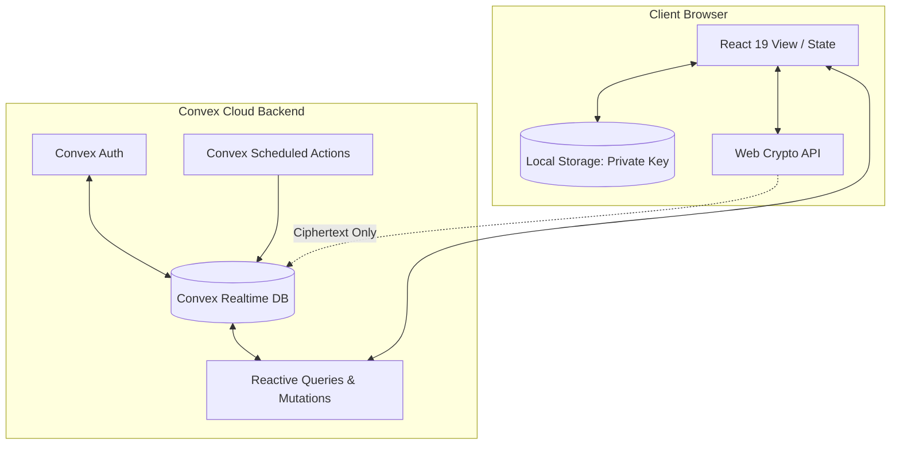
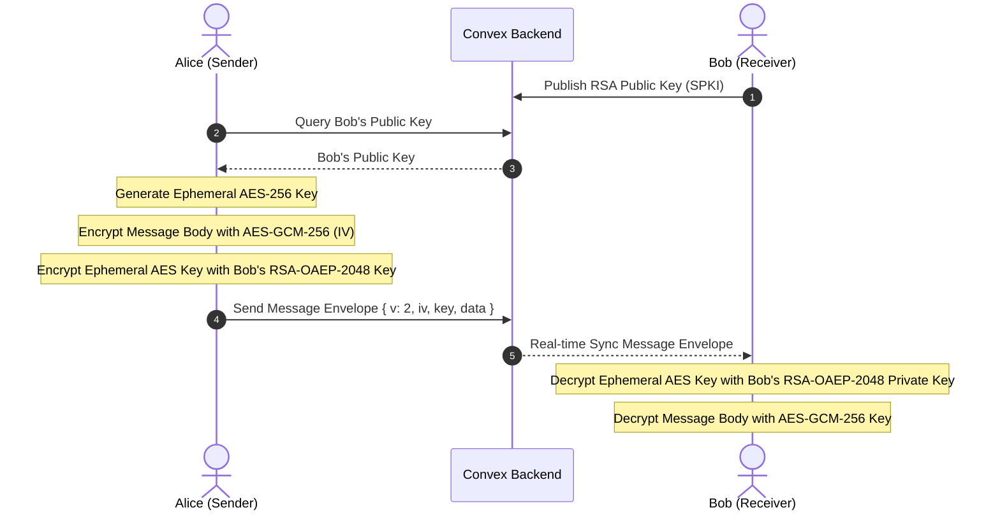

# 📚 Study Calendar

A high-performance, full-stack study productivity application designed to help students organize course materials, track exams with GPA mapping, log study time, schedule time-blocked calendar events, and build motivation through social study leaderboards and end-to-end encrypted messaging.

Built with a modern stack of **React 19**, **Convex** (real-time reactive backend), **TypeScript 6**, **Vite 8**, and **Web Crypto API**.

---

## 🏗️ Architectural Overview & Design System

The application is architected around two core principles: **real-time synchronization** and **Zero-Knowledge privacy**. 



### 🎨 Theme & Styling System
The visual style is built using a highly premium, dark-first styling system (supporting light/dark mode toggles) written entirely in **Vanilla CSS**.
- **Dynamic CSS Variables**: All design tokens (borders, glassmorphic backdrops, gradients, core colors, accents, font weightings) are fully tokenized.
- **Custom Accent Colors**: Users can customize their accent color, border style, and layouts dynamically. Custom styles are persisted in the `userSettings` Convex collection and applied in real time to the document root variables.
- **Glassmorphism & Micro-animations**: Focus rings, button scale hovers, and animated progress SVGs provide a responsive, premium tactile feel.

---

## 🔒 Security Architecture: E2EE & Zero-Knowledge Escrow (ZKE)

Study Calendar implements a robust security model for user-to-user messaging. By combining a **hybrid encryption scheme** with a client-derived **Zero-Knowledge Escrow (ZKE)**, it ensures that your private chat history is completely secure against third parties, including database breaches and compromised server infrastructure.

### 1. Hybrid Encryption Flow (AES-GCM + RSA-OAEP)
To secure direct chat, the client utilizes standard hybrid envelope cryptography via the native browser `SubtleCrypto` API:



* **AES-256-GCM**: Message bodies are encrypted with a random, one-time 256-bit AES key using a 96-bit initialization vector (IV).
* **RSA-OAEP-2048**: The one-time AES key is wrapped (encrypted) with the recipient's 2048-bit RSA public key.
* **Envelope Format**: Transmitted messages are encapsulated in a versioned JSON payload:
  ```json
  {
    "v": 2,
    "iv": "Base64(96-bit IV)",
    "key": "Base64(RSA-Wrapped AES Key)",
    "data": "Base64(AES-GCM Ciphertext)"
  }
  ```

---

### 2. Zero-Knowledge Private Key Escrow (ZKE)
Historically, E2EE private keys were saved strictly in the client's `localStorage`. If the user cleared their browser cache, the private key was lost forever, rendering all historical message history unreadable. 

To solve this, Study Calendar implements a **Zero-Knowledge Escrow** which backs up the private key to the Convex cloud database *without* revealing the password or plaintext private key to the server.

#### A. Key Escrow (Backup Flow)
When configuring their profile, the user enters a secure recovery password.

```mermaid
graph TD
    Pwd[Recovery Password] & Salt[Random Salt 16B] --> PBKDF2[PBKDF2-HMAC-SHA256 <br> 600,000 Iterations]
    PBKDF2 --> AES[Derived AES-256-GCM Key]
    PrivKey[RSA-OAEP-2048 Private Key] --> Export[Export to PKCS#8 Raw Bytes]
    Export & AES --> Encrypt[AES-GCM-256 Encryption]
    Encrypt --> Ciphertext[Base64 Payload: IV || Ciphertext]
    Ciphertext --> Convex[Convex: userProfiles.encryptedPrivateKey]
    Salt --> ConvexSalt[Convex: userProfiles.userSalt]
```

1. **Key Derivation (PBKDF2)**: A cryptographically strong, random 16-byte salt is generated client-side. The client derives a 256-bit AES key from the user's password using **PBKDF2-HMAC-SHA256** with **600,000 iterations** (exceeding NIST guidelines).
2. **Encryption**: The 2048-bit RSA private key is exported as PKCS#8 bytes, encrypted using the derived AES key with AES-GCM-256 (using a unique 12-byte IV), and packed into a combined format (`iv || ciphertext`).
3. **Storage**: The `salt` (Base64) and the encrypted payload are uploaded to Convex. The raw password and the derived AES key **never leave the client's browser memory**.

#### B. Key Recovery (Restore Flow)
If `localStorage` is cleared or the user signs in on another browser:

1. The client queries the database for the user's `userSalt` and `encryptedPrivateKey`.
2. A recovery modal prompts the user to enter their recovery password.
3. The client derives the AES key again using the retrieved salt and the entered password.
4. The client decrypts the encrypted payload. If the password is correct, the AES-GCM authentication tag validates, yielding the raw PKCS#8 private key bytes.
5. The decrypted key is imported as a SubtleCrypto key object and saved back to local storage.

> [!IMPORTANT]
> **No Password Transmissions**: The server cannot decrypt messages because it only hosts the salt, initialization vector, and encrypted private key bytes. It never has access to the user's recovery password or the derived AES key.
> 
> **Persistent Message History**: With the introduction of ZKE, the 72-hour automated message deletion cron job is **disabled** by default, allowing users to keep their chat history permanently.

---

## 🛠️ Complete Feature Modules

| Module | Features & Technical Details |
|---|---|
| **📊 Dashboard** | - At-a-glance visualization of upcoming exams, today's schedule, backlog tasks, and daily study log summaries.<br>- Calculates active study streak (consecutive days with logs) and tracks weekly progress through dynamic charts. |
| **📅 Interactive Calendar** | - Unified monthly grid visualizing time-blocked schedule events, daily to-do deadlines, and study session records.<br>- Color-coded representations dynamically linked to individual subject definitions. |
| **📝 Exams & Gradebook** | - Grade entry tracking with weighted GPA calculation support based on course coefficients.<br>- Shared metadata allowing users to import exams direct from their friend network. |
| **📋 Tasks & Backlog** | - Segmented between **Daily Tasks** (date-specific) and **General Backlog**.<br>- Custom priority weighting (low, medium, high) and status tracking (todo, in progress, complete). |
| **⏳ Daily Activity Log** | - Accurate time tracking tool allowing users to log study sessions with notes, categorized by course/subject. |
| **🍅 Pomodoro Timer** | - Fully customizable Pomodoro intervals (work block, short break, long break) with an animated circular progress ring.<br>- Option to automatically compile and commit completed timers directly into the study log history. |
| **⏱️ Floating Stopwatch** | - Float widget that overlays the workspace with draggable placement, customizable scale, and background opacity controls. |
| **👥 Friends & Social Leaderboard** | - Social networking via unique handles (e.g. `@username`).<br>- Real-time status indicators (online/offline/active) and block/unblock tools.<br>- Weekly leaderboard displaying aggregated study hours per friend to motivate learning. |
| **💬 Secure Encrypted Chat** | - Real-time client-to-client chatting protected by ZKE and hybrid E2EE, including read-receipt tracking. |
| **🌐 Internationalization (i18n)** | - Full English (`en`) and French (`fr`) translation dictionaries. Real-time language switching without page reloads. |

---

## 📂 Project Structure

```
Study_calendar/
├── convex/                  # Convex Cloud Backend
│   ├── auth.config.ts       # Auth provider configurations
│   ├── auth.ts              # Custom Convex-Auth mutation hooks
│   ├── crons.ts             # Scheduled backend jobs (Auto-delete disabled)
│   ├── dailyLogs.ts         # Study duration tracking functions
│   ├── events.ts            # Calendar schedule functions
│   ├── exams.ts             # Grade & exam functions
│   ├── friends.ts           # Social graphs, block lists, and E2EE messaging
│   ├── http.ts              # External webhook/HTTP routes
│   ├── schema.ts            # Definitive Convex database schema
│   ├── subjects.ts          # Course mapping database actions
│   └── tasks.ts             # Backlog & daily to-do actions
├── src/                     # React Single Page Application (Vite)
│   ├── components/
│   │   ├── auth/            # Sign In, Sign Up, and OTP Password Reset UI
│   │   ├── friends/         # Direct Messages, Key Escrow Recovery, Leaderboard & Friend Lists
│   │   ├── layout/          # Premium Navigation bars and theme providers
│   │   └── ui/              # Glassmorphic modals, tooltips, buttons, select inputs, and status badges
│   ├── i18n/
│   │   └── translations.ts  # Dictionary containing EN and FR keymaps
│   ├── pages/
│   │   ├── AnalyticsView.tsx    # Donut statistics, time graphs, and dynamic achievements
│   │   ├── CalendarView.tsx     # Full Month Grid with unified logs/events
│   │   ├── Dashboard.tsx        # Overview dashboard widget system
│   │   ├── ExamsView.tsx        # Grade tracking spreadsheet & imports
│   │   ├── FriendsView.tsx      # Social hub & encrypted messenger container
│   │   ├── PomodoroView.tsx     # Timers and logs compiler
│   │   ├── SettingsView.tsx     # Language, theme, profile handle, and block configuration
│   │   ├── SubjectsView.tsx     # Course category manager
│   │   └── TasksView.tsx        # Priority Kanban columns
│   ├── utils/
│   │   ├── colorUtils.ts    # HSL-persisted color shifting utilities
│   │   ├── crypto.ts        # Core Web Crypto algorithms (AES, PBKDF2, RSA)
│   │   └── statsUtils.ts    # Date algorithms for study streaks and achievements
│   ├── App.tsx              # Application layout router
│   ├── main.tsx             # Application bootstrap & Convex Client Provider
│   └── index.css            # System CSS tokens, variables, & customized components
├── biome.json               # Code style & quality configuration
├── knip.json                # Dead code analyzer configurations
└── doctor.config.ts         # React environment audit setups
```

---

## 💾 Database Schema

The database model is defined statically in [convex/schema.ts](file:///home/thelio/Github/Study_calendar/convex/schema.ts). Below is a summary of the schema configuration:

| Table Name | Indexed Fields | Key Columns | Purpose |
|---|---|---|---|
| `subjects` | `by_userId` | `userId`, `name`, `color`, `icon` | Course category tags |
| `exams` | `by_userId`, `by_userId_and_date`, `by_subjectId` | `userId`, `subjectId`, `title`, `date`, `coefficient`, `grade`, `completed` | Grade tracking & coefficients |
| `dailyLogs` | `by_userId_and_date`, `by_userId_and_subjectId` | `userId`, `date`, `subjectId`, `content`, `duration` | Study session recording logs |
| `tasks` | `by_userId`, `by_userId_and_date`, `by_userId_and_taskType` | `userId`, `date`, `title`, `completed`, `priority`, `subjectId`, `taskType` | To-do lists (Daily/Backlog) |
| `events` | `by_userId_and_date`, `by_userId_and_subjectId` | `userId`, `date`, `startTime`, `endTime`, `title`, `subjectId` | Time-blocked calendar items |
| `userProfiles` | `by_userId`, `by_username` | `userId`, `username`, `publicKey`, `userSalt`, `encryptedPrivateKey` | Profile metadata, public keys, and ZKE escrow |
| `friendships` | `by_user1`, `by_user2`, `by_user1_and_user2` | `user1`, `user2`, `status`, `senderId` | Bilateral friend links |
| `messages` | `by_conversation`, `by_receiverId`, `by_timestamp` | `senderId`, `receiverId`, `encryptedBody`, `senderEncryptedBody`, `timestamp`, `read` | E2EE direct chat logs |
| `blocks` | `by_userId`, `by_userId_and_blockedUserId` | `userId`, `blockedUserId` | Personal block associations |
| `userSettings` | `by_userId` | `userId`, `theme`, `customizations` | Custom layouts and colors |
| `rateLimits` | `by_key` | `key`, `count`, `resetTime` | Rate limit tracker |

---

## 🚀 Installation & Setup

### Prerequisites
- Node.js >= 18
- `npm` or `pnpm`
- A free account on [Convex Cloud](https://dashboard.convex.dev)
- A free account on [Resend](https://resend.com) for sending OTP emails

### Steps

1. **Clone & Install Dependencies**
   ```bash
   npm install
   # Or using pnpm
   pnpm install
   ```

2. **Configure Environment Variables**
   Create a `.env.local` file in the root directory:
   ```bash
   cp .env.local.example .env.local
   ```
   Provide the credentials for your Convex backend:
   ```env
   VITE_CONVEX_URL=https://your-project.convex.cloud
   ```

3. **Initialize the Convex Dev Engine**
   Run the dev command to spin up the local reactive functions compiler and hook it to your Convex Cloud deployment:
   ```bash
   npx convex dev
   ```
   > [!TIP]
   > Ensure you configure `AUTH_RESEND_KEY` (your Resend API key) inside your Convex project dashboard environment variables. This enables the password-reset OTP verification mechanism.

4. **Launch the Frontend Client**
   In a separate terminal shell, run:
   ```bash
   npm run dev
   # Or using pnpm
   pnpm dev
   ```
   Open `http://localhost:5173` in your browser.

---

## 🧪 Testing & Validation Pipeline

We run a strict, automated, non-interactive validation script before releasing code changes. This is configured in `package.json` under `npm run validate`.

To validate linting, dead code, and React framework standards:
```bash
npm run validate
```

This commands executes:
1. **Biome Compiler (`npx biome check --write .`)**: Assures code style formatting, semantic rules, and standard React 19 hook implementations.
2. **Knip Compiler (`npx knip`)**: Checks for unused dependencies, orphaned files, and dead exports.
3. **React Doctor (`npx react-doctor -y --verbose`)**: Scans for configuration issues, version conflicts, and general performance bugs in the React dependency graph.

All checks must exit with code `0` for code validation to succeed.

---

## 📄 License

Proprietary Codebase. All rights reserved.
